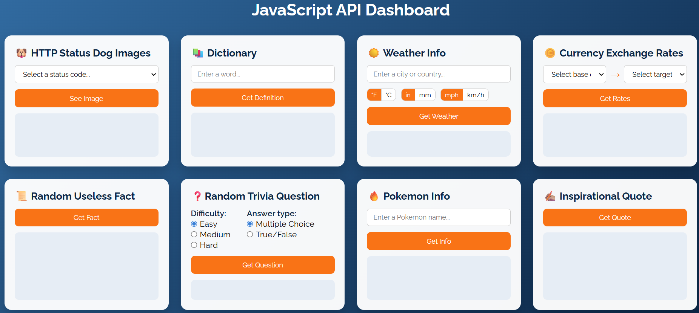
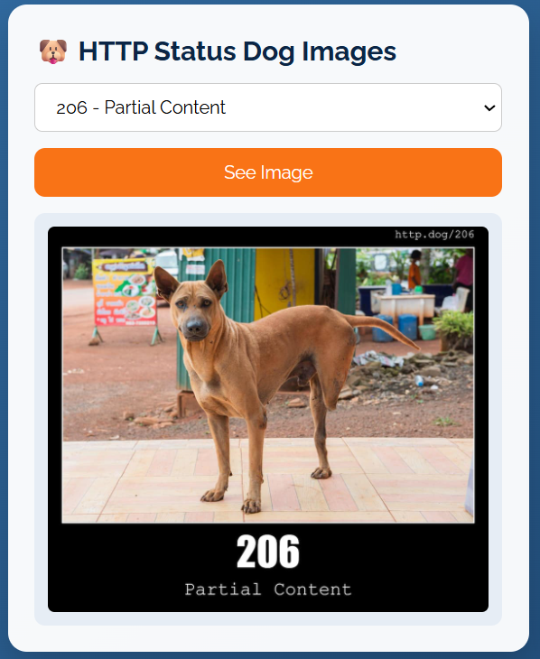
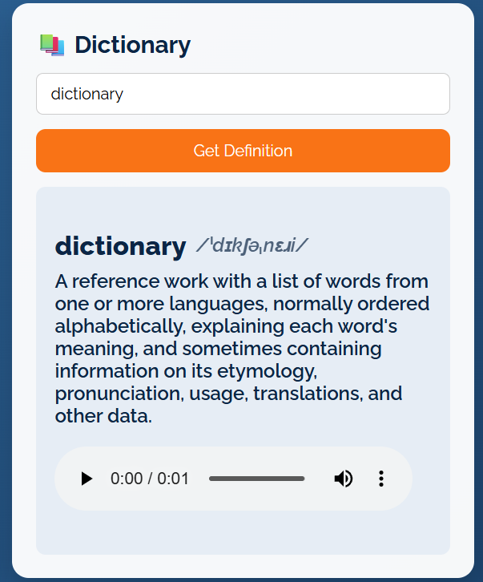
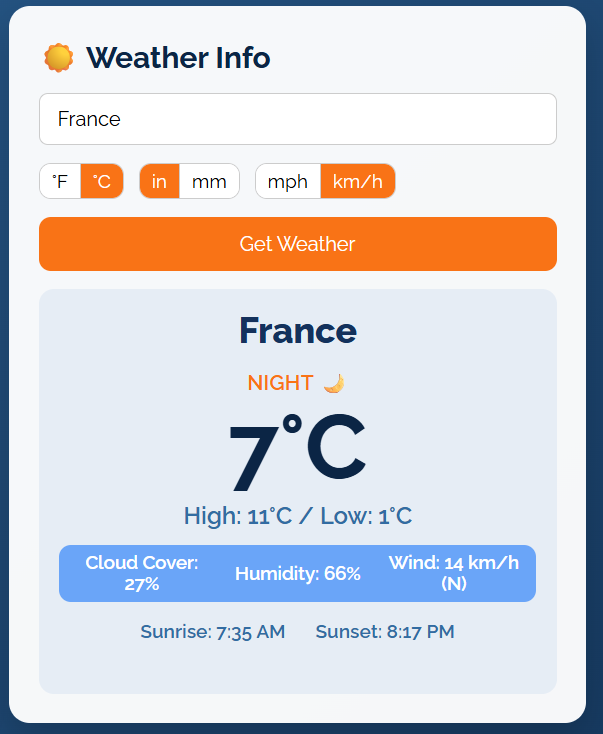
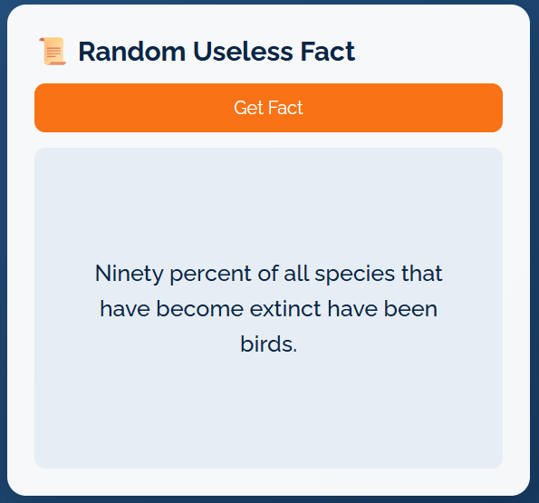
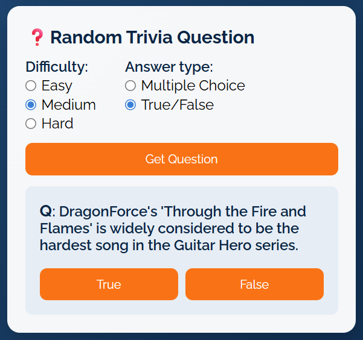
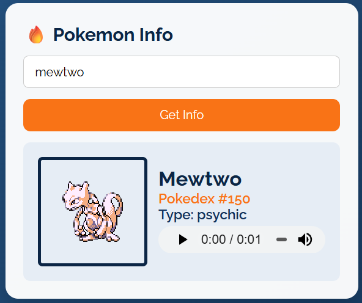

# JavaScript API Dashboard
JavaScript API dashboard integrating 8 external endpoints with real-time data, dynamic UI, and responsive design.

## Overview
This dashboard connects to 8 different APIs and displays their data through interactive, user-driven components. Each section functions as a self-contained module that handles input, performs asynchronous API requests, and dynamically renders results to the UI.

The project focuses on building a scalable front-end structure using vanilla JavaScript while reinforcing concepts such as async data handling, DOM manipulation, and responsive layout design.

The application emphasizes:
- Asynchronous programming with fetch and async/await
- Dynamic DOM manipulation
- Responsive layout using CSS Grid and Flexbox
- Clean separation of logic and UI

The interface is built as a grid of independent API cards, each functioning as its own mini application.

## Features
### API Gallery

<table>
  <tr>
    <td align="center">
       
      <b>HTTP Status Dogs</b>
    </td>
    <td align="center">
       
      <b>Dictionary</b>
    </td>
    <td align="center">
       
      <b>Weather</b>
    </td>
    <td align="center">
       
      <b>Currency</b>
    </td>
  </tr>

  <tr>
    <td align="center">
       
      <b>Random Fact</b>
    </td>
    <td align="center">
       
      <b>Trivia</b>
    </td>
    <td align="center">
       
      <b>Pokémon</b>
    </td>
    <td align="center">
       
      <b>Quotes</b>
    </td>
  </tr>
</table>

## Tech Stack
- HTML5
- CSS3 (Grid, Flexbox, responsive design)
- JavaScript (ES6+)
- Public APIs (Open-Meteo, OpenTDB, PokéAPI, DictionaryAPI, Frankfurter, etc.)

## Key Concepts Demonstrated
- Asynchronous data fetching with async/await
- Dynamic DOM creation and manipulation
- Event-driven programming
- Input validation and error handling
- Conditional API query construction (unit selection)
- Reusable helper functions (HTML decoding, array shuffling, data formatting)
- Responsive UI patterns using CSS Grid

## How to Run
1. Clone the repository
2. Open index.html in your browser

## Future Improvements
- Add loading states and animations
- Improve accessibility (ARIA roles, keyboard navigation)
- Implement custom UI components (dropdowns, toggles)
- Expand API integrations
- Add persistent state or user preferences

## Why I Built This
This project was built to strengthen my understanding of working with external APIs, handling asynchronous data, and building interactive user interfaces using vanilla JavaScript. It allowed me to practice structuring scalable front-end logic without relying on frameworks.